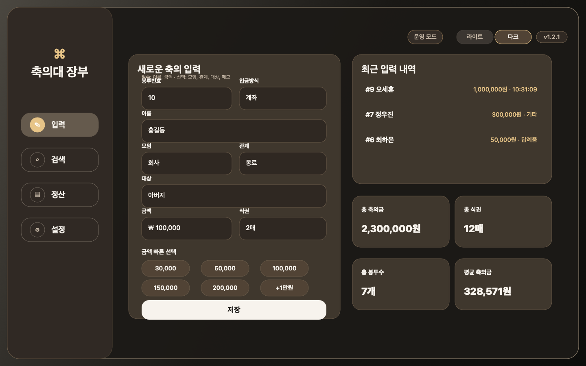
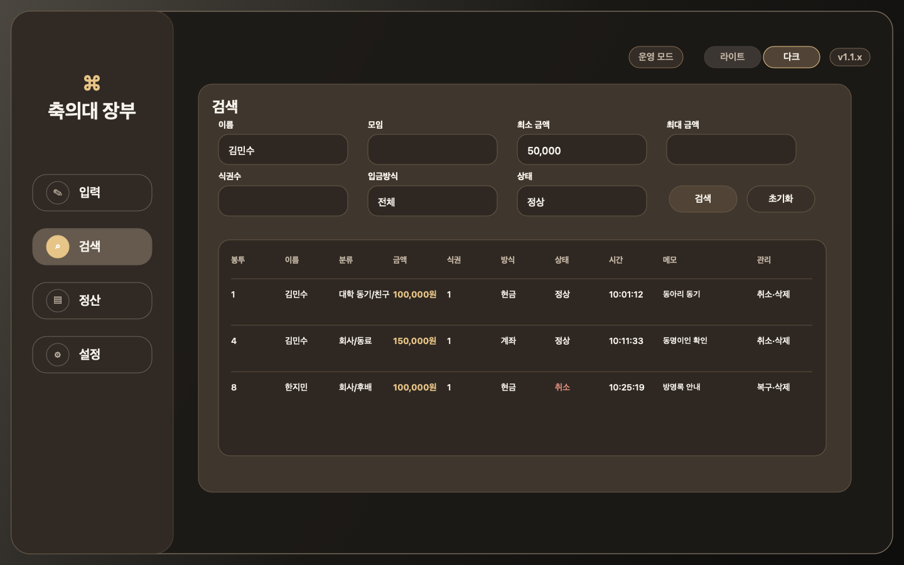
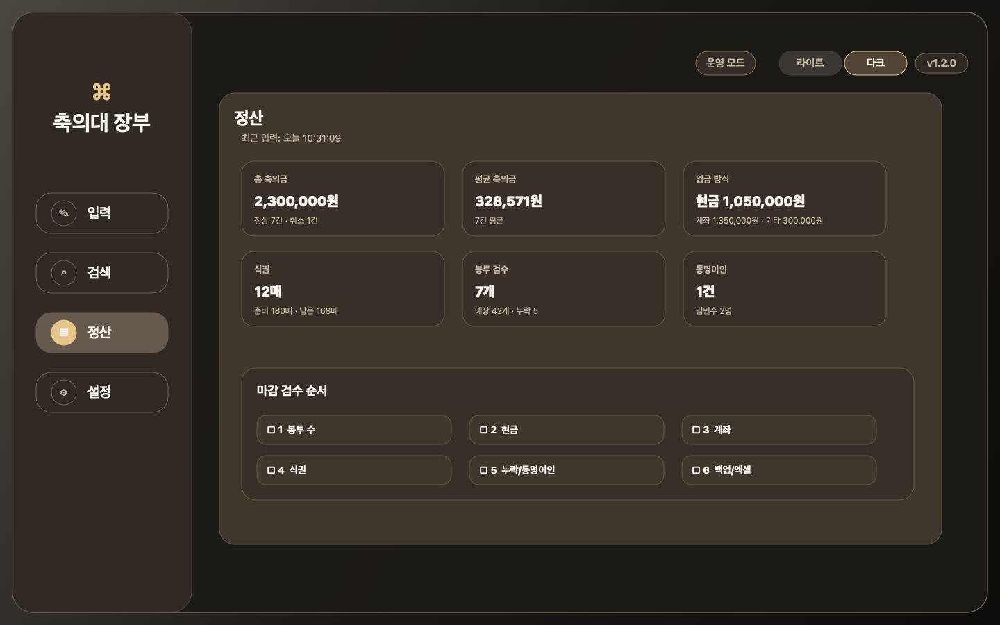
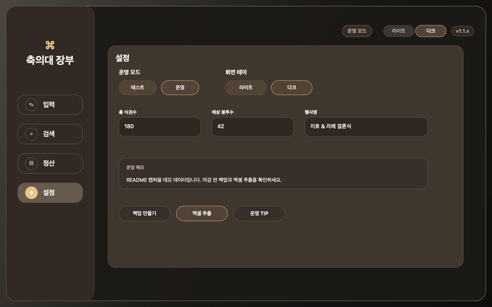

# 축의대 장부

<p align="center">
  
</p>

<p align="center">
  한국 결혼식 축의대에서 축의금, 봉투, 식권을 빠르게 기록하고<br />
  검색, 정산, 백업, 엑셀 추출까지 오프라인으로 처리하는 macOS 앱입니다.
</p>

<p align="center">
  <a href="https://github.com/Rafe-Giho/wedding-ledger/releases/latest"></a>
  
  
  
  
</p>

## Preview

| 빠른 입력 | 검색 |
| --- | --- |
|  |  |

| 정산 | 설정 |
| --- | --- |
|  |  |

## 주요 기능

- 한 명이 신부측 또는 한쪽 축의대에서 빠르게 입력하는 흐름에 맞춘 macOS 데스크톱 앱
- 봉투번호 자동 증가, 이름, 모임, 관계, 금액, 식권수, 입금방식, 메모 기록
- 한국 축의금에서 자주 쓰는 금액 빠른 선택과 `+1만원` 버튼
- 모임/관계 직접 입력 시 목록 자동 저장
- 동명이인 즉시 감지, 기존 기록 확인 후 새 동명이인 저장
- 계좌 입금 기록은 실제 입금시간 직접 수정 가능
- 검색어 Enter 검색, 검색 초기화, 상태별 검색, 동명이인 빠른 필터, 기록 취소/복구/삭제
- 정산 현황, 평균 축의금, 봉투 누락, 식권 잔여량, 현금/계좌 합계 확인
- 마감 검수 순서 체크, 취소/복구 이력, 자동 백업, 백업 복원
- 전체내역, 요약, 검색용, 시간대별, 동명이인, 수정이력, 안내 시트를 포함한 `.xlsx` 추출
- 앱 비밀번호, 복구키 기반 재설정, 로컬 SQLite 저장, 라이트/다크 테마

## 설치

가장 쉬운 설치 방법:

```bash
curl -L https://github.com/Rafe-Giho/wedding-ledger/releases/latest/download/install_macos.sh -o /tmp/install_wedding_ledger.sh
sh /tmp/install_wedding_ledger.sh
```

설치 위치:

```txt
~/Applications/축의대 장부.app
```

GitHub에서 zip을 직접 받아 실행할 수도 있지만, macOS Gatekeeper 격리 속성 때문에 `손상되었기 때문에 열 수 없습니다` 메시지가 뜰 수 있습니다. 위 설치 스크립트는 앱을 설치한 뒤 격리 속성을 제거하고 코드 서명을 검증합니다.

## 현장 운영 흐름

1. 앱 실행 후 최초 비밀번호 설정
2. 복구키를 안전한 곳에 별도 보관
3. 테스트 모드에서 입력, 검색, 취소/복구, 엑셀 추출 연습
4. 설정에서 총 식권수, 예상 봉투수, 행사명, 운영 메모 입력
5. 테스트 데이터 초기화
6. 운영 모드로 전환
7. 봉투를 받으면 봉투 겉면에 번호를 적고 앱에 기록
8. 식권수와 입금방식, 메모까지 입력
9. 잘못 입력한 기록은 검색에서 취소/복구하거나 확인 후 삭제
10. 정산 화면에서 봉투 수, 현금, 계좌, 식권, 동명이인 확인
11. 마감 전 백업 생성 후 `.xlsx` 엑셀 추출

## 엑셀 추출

추출 파일은 `.xlsx` 형식이며, 행사 후 정리와 검색을 쉽게 하기 위한 시트를 포함합니다.

- `전체내역`: 봉투번호, 이름, 모임, 관계, 금액, 식권수, 방식, 상태, 입력시간, 메모
- `요약`: 총액, 평균, 입금방식별 합계, 식권/봉투 검수값
- `검색용`: 조건 입력과 자동 필터 확인용 영역
- `시간대별`: 입력 시간이 많은 구간 확인
- `동명이인`: 같은 이름이 여러 명인 기록 점검
- `수정이력`: 취소/복구/삭제 등 감사 로그
- `안내`: 축의대 운영 팁과 마감 체크리스트

자세한 설계는 [docs/excel-export.md](docs/excel-export.md)를 참고하세요.

## 데이터와 보안

모든 데이터는 기본적으로 내 Mac에만 저장됩니다.

```txt
~/Library/Application Support/WeddingLedger/
```

- 앱 데이터베이스 권한은 로컬 사용자 기준으로 제한합니다.
- 비밀번호는 PBKDF2-HMAC-SHA256 기반 해시로 저장합니다.
- 복구키를 잃으면 비밀번호 복구가 불가능합니다.
- 잘못 입력한 기록은 취소/복구하거나 확인 후 삭제할 수 있고, 주요 변경은 감사 로그에 남깁니다.
- 실제 DB, 백업, 엑셀 파일은 Git에 포함하지 않습니다.

보안 설계는 [docs/security.md](docs/security.md)를 참고하세요.

## 개발

요구 사항:

- macOS 14 이상
- Xcode Command Line Tools 또는 Swift 6 빌드 환경

개발 실행:

```bash
swift run --package-path swift/WeddingLedgerSwift
```

앱 번들 생성:

```bash
python3 scripts/build_swift_macos_app.py
```

아이콘 재생성:

```bash
swift scripts/generate_app_icon.swift
```

README 화면 이미지 재생성:

```bash
swift scripts/generate_readme_screenshots.swift
```

## 배포

현재 릴리즈는 ad-hoc 서명된 zip과 설치 스크립트를 제공합니다. 일반적인 DMG 드래그 설치와 경고 없는 배포를 하려면 Apple Developer ID 서명과 notarization이 필요합니다.

- 패키징 문서: [docs/packaging.md](docs/packaging.md)
- notarization 준비: [docs/apple-notarization.md](docs/apple-notarization.md)
- 최신 릴리즈: [GitHub Releases](https://github.com/Rafe-Giho/wedding-ledger/releases)

## GitHub Topics 추천

`wedding`, `ledger`, `macos`, `swiftui`, `sqlite`, `offline-first`, `xlsx`, `korean-wedding`, `event-management`

## License

[MIT](LICENSE)
